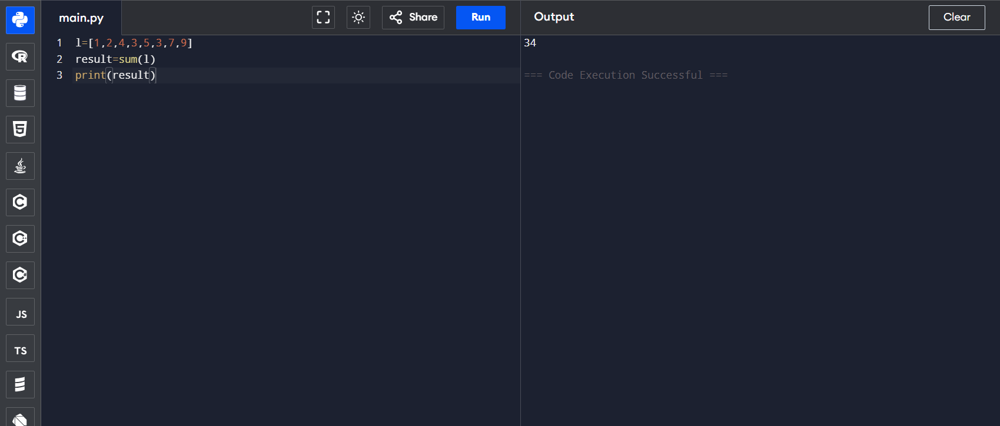

# List Operations in Python: Sum of List Items

## 🎯 Aim
To write a Python program that calculates the **sum of all elements** in a list.

## 🧠 Algorithm
1. Define a list of numbers.
2. Use Python’s built-in `sum()` function to calculate the total.
3. Print the result.

## 🧾 Program
```
l=[1,2,4,3,5,3,7,9]
result=sum(l)
print(result)
```

## Output

## Result
Hence the program is executed and the output is verified