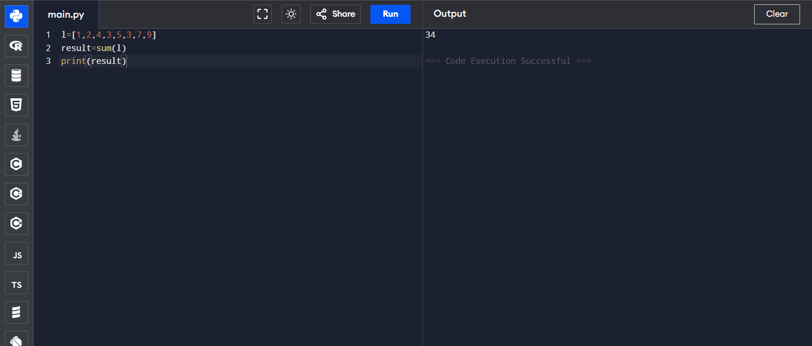
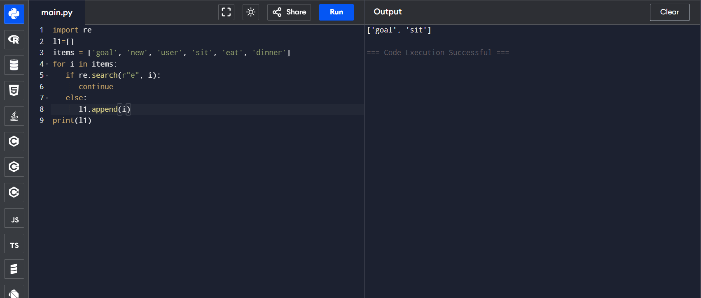
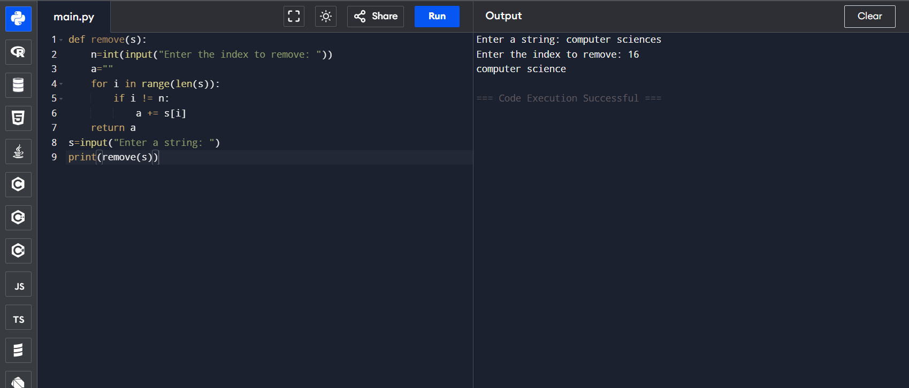
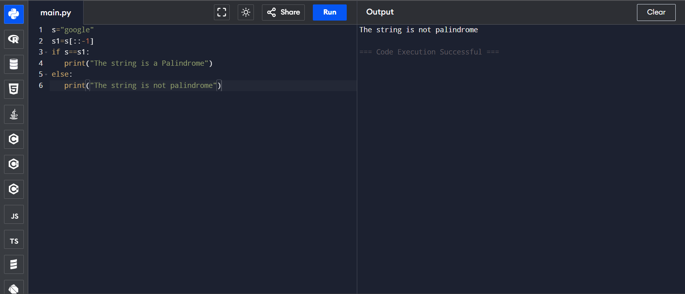

# List Operations in Python: Sum of List Items

## 🎯 Aim
To write a Python program that calculates the **sum of all elements** in a list.

## 🧠 Algorithm
1. Define a list of numbers.
2. Use Python’s built-in `sum()` function to calculate the total.
3. Print the result.

## 🧾 Program
```
l=[1,2,4,3,5,3,7,9]
result=sum(l)
print(result)
```

## Output

## Result
Hence the program is executed and the output is verified

# Regex in Python: Filter Words Without the Letter 'e'

## 🎯 Aim
To write a Python program that filters out and returns all elements from a list **that do not contain the letter `'e'`**, using **regular expressions (regex)**.

## 🧠 Algorithm
1. Import the `re` module.
2. Initialize an empty list `l1` to store results.
3. Define a list of words:  
   `items = ['goal', 'new', 'user', 'sit', 'eat', 'dinner']`
4. Iterate through each word in the list:
   - Use `re.search(r"e", i)` to check if the word contains `'e'`.
   - If **not**, append the word to `l1`.
5. Print the final filtered list.

## 🧾 Program
```
import re
l1=[]
items = ['goal', 'new', 'user', 'sit', 'eat', 'dinner']
for i in items:
   if re.search(r"e", i):
      continue
   else:
      i.append(l1)
print(l1)
```

## Output

## Result
Hence the program is executed and the output is verified

# Module-3
# 🧹 Strings-Remove Nth Index Character from a String

## 🎯 Aim
To write a Python program that accepts a string and removes the character at a specified index.

## 🧠 Algorithm
1. Define a function named `remove` that takes the input string as an argument.
2. Read the index `n` from the user input.
3. Initialize an empty string `a` to store the new string.
4. Iterate over each index of the string using a `for` loop.
5. Check if the current index `i` is not equal to `n`.
6. If `i != n`, append the character at index `i` to string `a`.
7. After the loop, return the modified string `a`.
8. Print the final result.

## 💻 Program
```
def remove(s):
    n=int(input("Enter the index to remove: "))
    a=""
    for i in range(len(s)):
        if i != n:
            a+=s[i]
    return a
s=input("Enter a string: ")
print(remove(s))
```

## Output

## Result
Hence the program is executed and the output is verified

# Strings-Palindrome Check in Python (Without Built-in Functions)

## 🎯 Aim
To write a Python program to check whether the string `"google"` is a **palindrome** or not, without using built-in palindrome checking functions.

## 🧠 Algorithm
1. Assign the string `"google"` to a variable.
2. Reverse the string manually using slicing (`[::-1]`).
3. Compare the original string with the reversed string.
   - If they are equal, print that the string is a palindrome.
   - Otherwise, print that it is not a palindrome.
4. Execute the program.

## 🧾 Program
```
s="google"
s1=s[::-1]
if s==s1:
   print("The string is a Palindrome")
else:
   print("The string is not palindrome")
```

## Output

## Result
Hence the program is executed and the output is verified

# Tuple in Python: Check Element Existence

## 🎯 Aim
To write a Python program that checks if the element `'n'` and the element `8` exist within a given tuple.

## 🧠 Algorithm
1. Define a tuple `x` with some letters and numbers.
2. Use the `in` operator to check if the string `'n'` exists within the tuple.
3. Use the `in` operator to check if the integer `8` exists within the tuple.
4. Print the results.

## 🧾 Program
```
x=(23,5,2,54,100,'v','n','k','g')
if 8 in x:
    print("The number 8 is within the tuple")
else:
    print("the number 8 is not in the tuple")
if 'n' in x:
    print("The letter 'n' is within the tuple")
else:
    print("the letter 'n' is not in the tuple")
```

## Output

## Result
Hence the program is executed and the output is verified