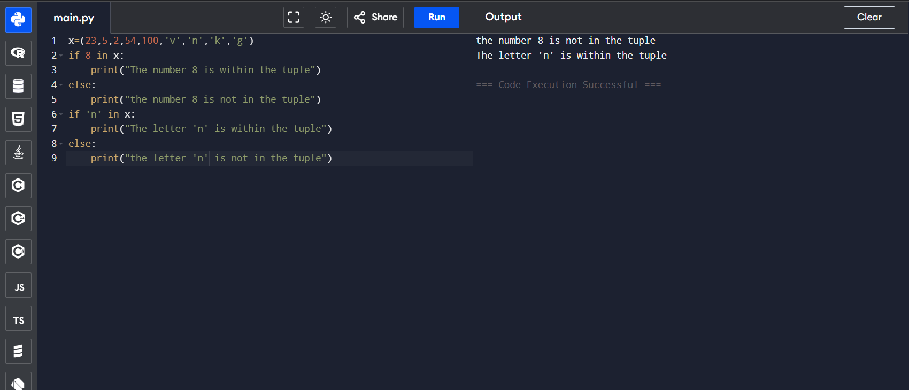

# Tuple in Python: Check Element Existence

## 🎯 Aim
To write a Python program that checks if the element `'n'` and the element `8` exist within a given tuple.

## 🧠 Algorithm
1. Define a tuple `x` with some letters and numbers.
2. Use the `in` operator to check if the string `'n'` exists within the tuple.
3. Use the `in` operator to check if the integer `8` exists within the tuple.
4. Print the results.

## 🧾 Program
```
x=(23,5,2,54,100,'v','n','k','g')
if 8 in x:
    print("The number 8 is within the tuple")
else:
    print("the number 8 is not in the tuple")
if 'n' in x:
    print("The letter 'n' is within the tuple")
else:
    print("the letter 'n' is not in the tuple")
```

## Output

## Result
Hence the program is executed and the output is verified